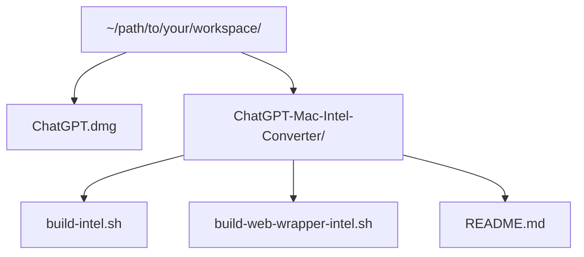

# ChatGPT Intel Builder for macOS (Unofficial)

Built by **m.j. zilla**
subscribe for more tools and insights [mecxist.substack.com](https://mecxist.substack.com/)

## Disclaimer

This is an **unofficial conversion tool** and is provided for **educational purposes only**.
It is not affiliated with or endorsed by OpenAI. Use at your own risk.

## What This Project Does

This project takes `ChatGPT.dmg` as input and produces `ChatGPTIntel.dmg` for Intel Macs.

## Files

- `build-intel.sh` - main build command
- `build-web-wrapper-intel.sh` - wrapper build helper
- `package.json` - optional npm script helpers
- `.gitignore` - ignores local artifacts

## Requirements

- macOS
- `bash`, `hdiutil`, `ditto`, `codesign`, `xattr`
- Node.js + npm
- Network access to npm registry (for Electron download)

## Quick Start

Keep files in this layout:



Use any local folder layout you prefer, then pass the correct DMG path to the script.

### 1) Go to the converter folder
### (If you're already in this folder skip to step 2):

```bash
cd ~/path/to/your/workspace/ChatGPT-Mac-Intel-Converter
```

### 2) Run this (copy/paste)

```bash
chmod +x ./build-intel.sh ./build-web-wrapper-intel.sh
./build-intel.sh ~/path/to/your/workspace/ChatGPT.dmg
```

### 3) Result

After a successful run, you should get:

- `ChatGPTIntel.dmg` - Intel wrapper output (most common with current native ChatGPT builds)
- `log.txt` - main build log
- `web-wrapper-log.txt` - wrapper build log

## Troubleshooting

- `ChatGPT.dmg` not found:
  Pass the full file path explicitly, for example:
  `./build-intel.sh "/absolute/path/to/ChatGPT.dmg"`
- `Permission denied` when running scripts:
  Run `chmod +x ./build-intel.sh ./build-web-wrapper-intel.sh` and retry.
- `node` or `npm` command not found:
  Install Node.js first, then run the build again.
- Build fails partway through:
  Check `log.txt` and `web-wrapper-log.txt` for the last error line and rerun.
- Output DMG not created:
  Confirm you ran from the converter folder and that `ChatGPT.dmg` is readable.
- App won’t open on macOS after install:
  Right-click the app and choose `Open` once to pass Gatekeeper prompts.

Still stuck? Message me on Substack: [mecxist.substack.com](https://mecxist.substack.com/)
